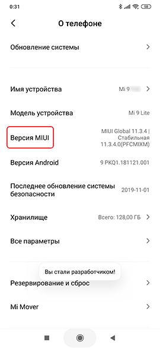
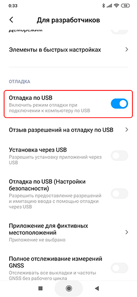
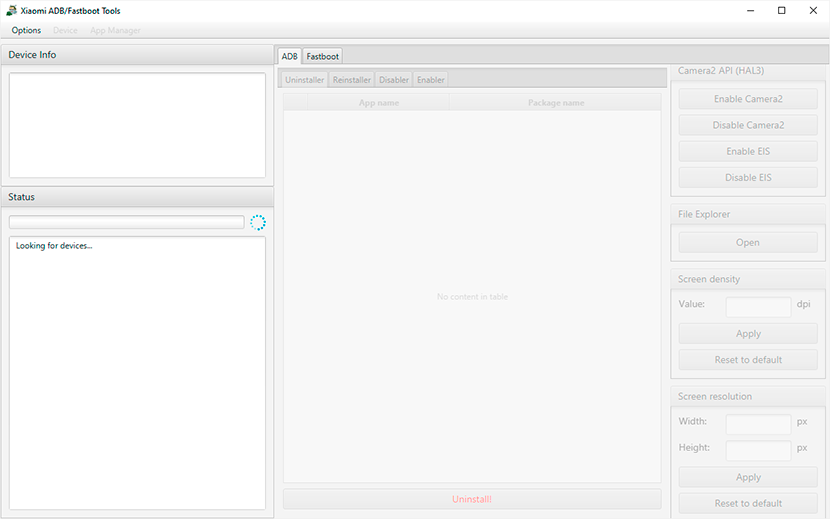
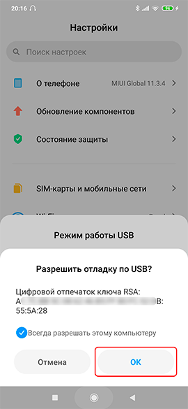
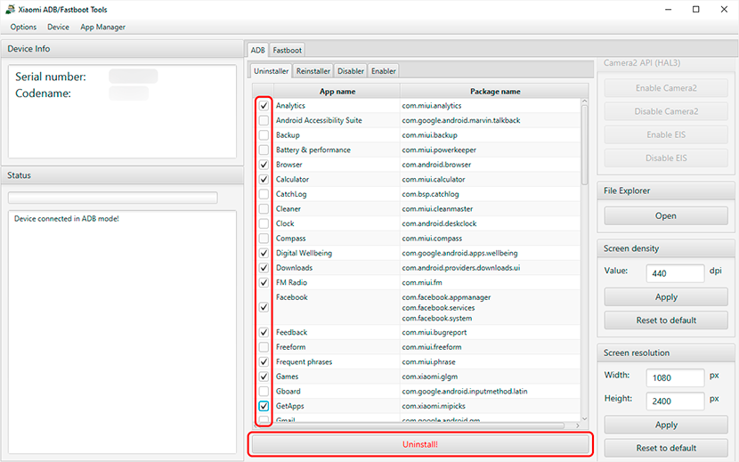
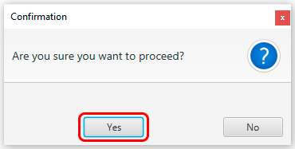
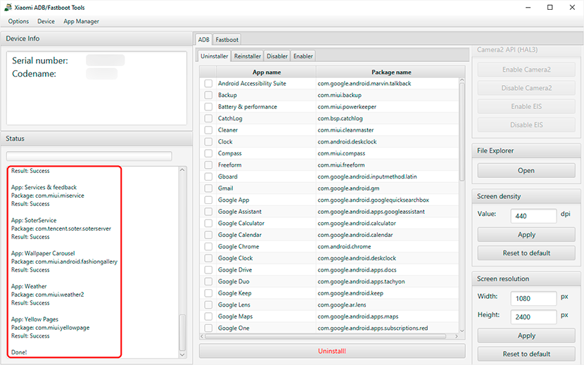
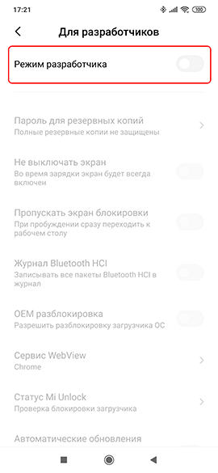
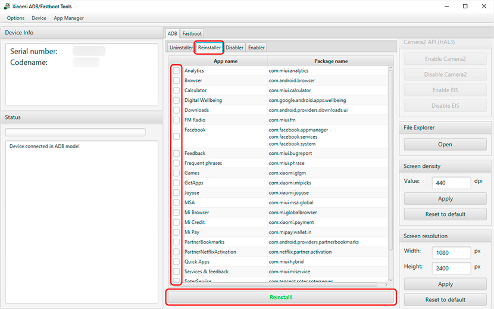

# Xiaomi ADB/Fastboot Tools

## Удаление встроенных приложений без рута на заблокированном и разблокированном загрузчике с помощью Xiaomi ADB/Fastboot Tools.

## Системные требования

- **Операционная система:** Windows, macOS, Linux.
- **Требуется [Java](https://www.oracle.com/java/technologies/downloads/#jdk17-windows) (JDK) версии не ниже 11.**

- Иногда на страрых версиях Windows при подключении девайса к ПК не появляется запрос на разрешение отладки по USB, и в Xiaomi ADB/Fastboot Tools ничего не происходит. В таком случае нужно установить [ADB Driver Lite](https://4pda.to/forum/dl/post/8137522/ADB+driver+v1.17+lite.zip).

## Какие приложения можно удалять?

[Список пакетов](https://4pda.to/forum/index.php?showtopic=921645&view=findpost&p=77962469), предустановленных на различные устройства Xiaomi, с описанием и с указанием того, можно ли их удалаять.

## Удаление встроенных приложений

1. На девайсе идём в *"Настройки > О телефоне"* и нажимаем 7 раз на *"Версия MIUI"* чтобы включить режим разработчика.

    

2. Возвращаемся в *"Настройки"*, идём в *"Расширенные настройки > Для разработчиков"* и включаем *"Отладка по USB"*.

    

3. На ПК запускаем *"XiaomiADBFastbootTools.jar"*.

    

4. Подключаем девайс к ПК и на запрос *"Разрешить отладку по USB?"* отвечаем *"ОК"*.

    

5. Ждём несколько секунд, появится информация о девайсе и список программ, предложенных к удалению.
6. Отмечаем галочками приложения, которые хотим удалить, и нажимаем *"Uninstall!"*. В появившемся окошке подтверждаем действие кнопкой *"Yes"*.

     

7. Информация о выполненных действиях отображается слева, в поле *"Status"*. После завершения процесса деинсталляции можно закрыть окно программы, и отсоединить девайс от ПК.

    

8. Можно выйти из режима разработчика. Для этого идём в *"Настройки" > "Расширенные настройки > Для разработчиков"* и выключаем *"Режим разработчика"*.

    

## Восстановление удалённых приложений

Если, например, после удаления приложения система стала работать нестабильно, то его можно восстановить.

Для этого подключаем девайс к Xiaomi ADB/Fastboot Tools как по инструкции выше до 7 шага.

Далее переходим на вкладку *"Reinstaller"*, отмечаем галочками приложения, которые хотим восстановить, и нажимаем *"Reinstall!"*.

